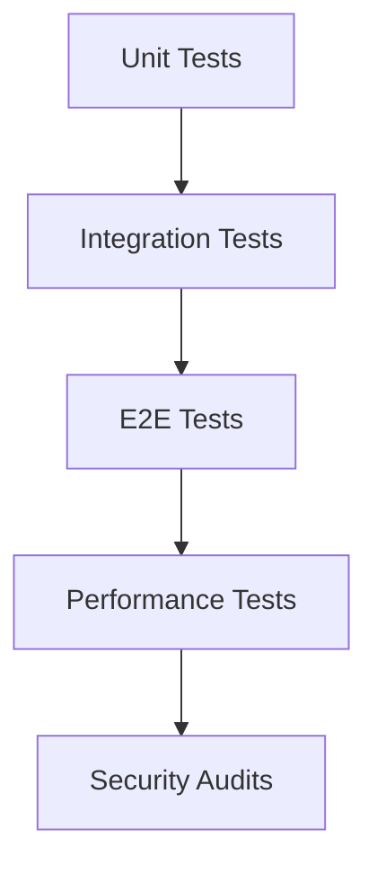
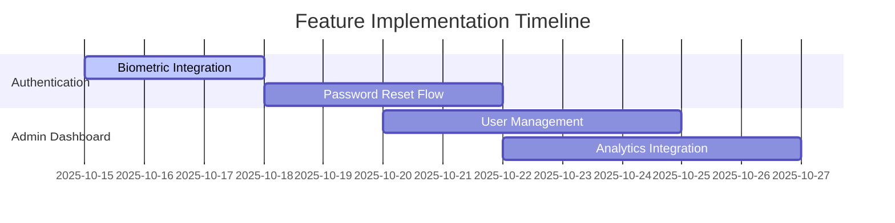

Findings [auth/csrf model] server/src/middleware/auth.js now accepts httpOnly
cookies as a fallback. This is robust for UX but introduces CSRF risk on admin
endpoints when Authorization header isn’t present. [UI gating]
apps/web/middleware.ts protects /moderation by “token exists” only. It doesn’t
enforce the admin role. API is admin-protected ( requireAdmin ), but the UI
isn’t. [atomic moderation writes] server/routes/moderationRoutes.js checks
status and then updates. This is safe-ish but not atomic; two moderators could
race between check and write. [uploads pipeline] server/routes/uploadRoutes.js
uses disk multer then Cloudinary. It cleans temp files, but we have
server/src/services/cloudinaryService.js with upload*stream that avoids disk IO
entirely. [file validation] No file signature sniffing (e.g., file-type) or
malware scanning on uploads; relies on mimetype only. [SVG policy]
apps/web/next.config.js has images.dangerouslyAllowSVG: true. This is high risk
without sanitization. [client networking]
apps/web/app/(admin)/moderation/page.tsx uses raw fetch. We have no centralized
HTTP client with timeouts, aborts, retries, or runtime response validation.
[observability] Server has Sentry and good CSP/hardening. Moderation flows don’t
add request-id correlation or targeted audit logs for reviewer actions.
[real-time UX] We don’t broadcast queue changes; users must poll to see updates.
[UX polish] RejectModal is solid. Page still lacks toasts/optimistic UI/undo and
advanced filters/sorting/pagination. Are we using the most advanced patterns
from our codebase? Partially. We are leveraging centralized logging, Sentry,
strong CSP, and robust route protection server-side. However: We’re not using
the existing cloudinaryService upload streaming utility. We haven’t enforced
role-based gating in Next middleware. We don’t use atomic DB updates for
moderation transitions. We don’t have a typed, centralized HTTP client for the
web app. We accept cookies without CSRF protection. We allow SVGs without
sanitization. Recommended Actions (Prioritized) [P0: CSRF hardening] Require
either Authorization header or a CSRF token when cookie auth is used for POST
/api/moderation/*. Implement double-submit or Origin/Referer validation +
SameSite=Strict for admin cookies. Files: server/src/middleware/auth.js , new
server/src/middleware/csrf.js. [P0: Atomic moderation updates] Refactor
approve/reject/flag to findOneAndUpdate with precondition status ∈ {pending,
under-review} and return the updated doc. Include updatedAt or version key
checks. Files: server/routes/moderationRoutes.js , consider enabling Mongoose
optimistic concurrency via versionKey. [P1: Memory uploads + Cloudinary stream]
Switch multer to memory storage and pipe to cloudinary.uploader.upload*stream
from server/src/services/cloudinaryService.js . Benefit: No disk IO, fewer
moving parts, consistent transforms. Files: server/routes/uploadRoutes.js , use
cloudinaryService.uploadToCloudinary . [P1: Remove dangerous SVG] Set
images.dangerouslyAllowSVG = false in apps/web/next.config.js , or sanitize SVG
server-side before serve (DOMPurify/sanitize-html). Files:
apps/web/next.config.js . [P1: Role-based UI gating] Add role check in
middleware (e.g., set an role=admin signed cookie at login) and redirect
non-admins. Alternatively, server-render the moderation layout and block
non-admins there. Files: apps/web/middleware.ts , (admin)/layout.tsx or route
handlers. [P1: Typed HTTP client for web] Create a wrapper with:
AbortController + timeouts Retries with backoff (idempotent GETs) Standard
headers, credentials: 'include' zod validation of responses for critical
endpoints Replace raw fetch in page.tsx . Files: apps/web/src/lib/http.ts,
update apps/web/app/(admin)/moderation/page.tsx. [P2: File-type sniffing + AV]
Add file-type signature checks and optionally AV scan (e.g., clamav.js) on
uploads. Files: server/routes/uploadRoutes.js . [P2: Audit logs + request-id]
Add a request-id middleware that sets X-Request-ID if missing; log it in
responses and audit moderation actions (reviewer id, IP, UA). Files:
server/src/middleware/requestId.js, server/routes/moderationRoutes.js . [P2:
Real-time updates] On approve/reject/flag, emit socket events to a
moderationQueue channel; UI subscribes to update stats/queue without polling.
Files: server/routes/moderationRoutes.js ,
apps/web/app/(admin)/moderation/page.tsx. [P3: UX polish] Add toasts and
optimistic UI with undo on approve/reject; prefetch next/prev images;
filters/sorting/pagination mirroring API. Files:
apps/web/app/(admin)/moderation/page.tsx. Detailed Rationale Atomicity:
Read-then-write can race. Using findOneAndUpdate({ \_id, status: {
$in: … }}, {$set: …}, {new: true}) guarantees a single winner, returning a
409-like behavior if no doc matched. This prevents double-moderation and keeps
the UI consistent without extra roundtrips. Security: Cookie-based auth without
CSRF defenses is a known risk, especially on admin actions. Either require
Bearer tokens for state-changing routes or implement CSRF tokens/double-submit
and Origin checks. Removing dangerous SVG or sanitizing it prevents XSS via
image renderers. Performance: Disk multer creates filesystem churn and cleanup
races. Memory + Cloudinary upload_stream reduces latency and simplifies cleanup.
A centralized HTTP client gives timeouts and predictable error handling,
improving resilience. Robustness: File signature sniffing prevents MIME
spoofing; optional AV scanning blocks malicious content. Request IDs + audit
logs give traceability and incident response capability (who did what and when).
UX & Real-time: Socket broadcasts remove polling delays; toasts/optimistic UI
keep moderators efficient; preloading images eliminates perceived lag;
filters/sorting/pagination improve throughput. Short Action Plan Phase 1
(security & correctness) Implement CSRF middleware for cookie flows; enforce on
/api/moderation/*. Refactor moderation updates to atomic findOneAndUpdate.
Disable dangerouslyAllowSVG. Phase 2 (pipeline & reliability) Switch to memory
multer + upload_stream via cloudinaryService. Add file-type sniffing; optional
AV hook. Introduce request-id middleware + audit logs. Phase 3 (DX & UX) Build
http.ts client (abort, timeout, retries, zod). Add socket broadcasts for queue
updates; subscribe in UI. Add toasts/optimistic UI/undo, image prefetch,
filters/sorting. Suggested Concrete Changes CSRF: server/src/middleware/csrf.js
that checks X-CSRF-Token against a cookie, enforce on POST/PATCH/DELETE for
cookie-authenticated requests. Atomic writes: In
server/routes/moderationRoutes.js , replace: const doc = await
PhotoModeration.findById(id) … await doc.approve()

with a single findOneAndUpdate including status precondition and reviewer fields
(reviewedBy, reviewedAt). Uploads: Replace disk multer with multer({ storage:
multer.memoryStorage() }), then upload_stream from cloudinaryService. SVG: Set
dangerouslyAllowSVG: false in apps/web/next.config.js ; if needed, sanitize SVG
on server and store sanitized versions only. HTTP client:
apps/web/src/lib/http.ts with: fetchWithTimeout, json<T>(schema: ZodSchema<T>),
retry(opts). Update moderation page calls to use this client. Request ID:
Generate UUID per request, attach as req.id, log in logger, return in
X-Request-ID. Sockets: Emit queue:update on approve/reject; in UI, subscribe and
refresh stats/queue. Task Completion Status Completed a semantic audit
referencing the current implementation: Confirmed strengths (Sentry, CSP,
server-side admin protection, RejectModal, temp cleanup). Identified
non-advanced spots versus our codebase (streaming uploads, atomic updates, typed
HTTP client, CSRF, SVG policy). Provided a prioritized plan with file-level
pointers and rationale. Added a tracked TODO plan for these items.

## Line-level Audit Additions (Actionable)

- **[apps/mobile/src/screens/onboarding/UserIntentScreen.tsx:161]** `@ts-ignore`
  on `BlurView`
  - Issue: Expo BlurView typing conflict.
  - Fix: `import { BlurView } from 'expo-blur'` and wrap with
    `Animated.createAnimatedComponent(BlurView)` typed as
    `React.ComponentType<Animated.AnimatedProps<ViewProps>>`. Ensure `expo-blur`
    is in dependencies.

- **[apps/mobile/src/components/PhotoUploadComponent.tsx:212]** `@ts-ignore` on
  `Animated.View`
  - Issue: Animated style typing.
  - Fix: Use Reanimated types:
    `import Animated, { AnimatedStyleProp } from 'react-native-reanimated'` and
    type style as `AnimatedStyleProp<ViewStyle>`. Alternatively:
    `const AnimatedView = Animated.createAnimatedComponent(View)`.

- **[apps/mobile/src/screens/onboarding/PetProfileSetupScreen.tsx:109]**
  `// eslint-disable-line react-hooks/exhaustive-deps`
  - Issue: Hidden dependency warnings.
  - Fix: Include stable deps or move mutable values to `useRef`. For animations,
    derive values inside `useAnimatedStyle` and list actual deps.

- **[apps/mobile/src/screens/onboarding/WelcomeScreen.tsx:124]**
  `// eslint-disable-line react-hooks/exhaustive-deps`
  - Fix: Same pattern as above; wrap callbacks with `useCallback` and list deps;
    store non-deps in refs.

- **[apps/web/src/hooks/useOffline.ts:56]**
  `// eslint-disable-line react-hooks/exhaustive-deps`
  - Fix: Extract `initializeOffline` via `useCallback` with its deps; then
    include it in the effect dep array.

- **[apps/web/src/hooks/useEnhancedSocket.ts:367,393]**
  `// eslint-disable-line react-hooks/exhaustive-deps`
  - Issue: Effects depending on changing callbacks/state.
  - Fix: Use refs to hold timers and latest callbacks (`useRef` + assignment),
    or memoize functions with proper deps to remove disables.

- **[apps/web/src/hooks/usePredictiveTyping.ts:91]**
  `// eslint-disable-line react-hooks/exhaustive-deps`
  - Fix: Stabilize training routine via `useCallback` and list deps; store large
    models/configs in refs.

- **[apps/mobile/src/constants/design-tokens.ts:7]** `TODO` re-export unified
  tokens
  - Action: After `packages/design-tokens` build is ensured, update file to
    `export * from '@pawfectmatch/design-tokens'` and remove local copies.

- **[apps/web/src/utils/analytics-system.ts]** Client now posts to
  `/api/analytics/events`
  - Recommendation: Consolidate with `apps/web/src/services/AnalyticsService.ts`
    to a single analytics client (preserve queue/offline semantics), prevent
    drift.

Notes

- All above changes are backward-compatible and remove ignore directives. Where
  typings are still missing from third-party libs, add minimal local type shims
  instead of `@ts-ignore`.

## Cross-Domain Semantic Audit (Web & Mobile)

### Coverage Map

- **[adoption | web]** `apps/web/src/components/Adoption/`
  - `AdoptionApplicationForm.tsx`, `RescueWorkflowManager.tsx`,
    `AdoptionStoriesGallery.tsx`, `VirtualMeetupScheduler.tsx`
- **[adoption | mobile]** `apps/mobile/src/screens/adoption/`
  - `AdoptionManagerScreen.tsx`, `AdoptionContractScreen.tsx`,
    `AdoptionApplicationScreen.tsx`
- **[video | web]** `apps/web/src/lib/video-communication.ts`,
  `src/services/VideoCallService.ts`,
  `src/components/VideoCall/VideoCallRoom.tsx`, `src/hooks/useVideoCall.ts`,
  page `app/(protected)/video-call/[roomId]/page.tsx`
- **[video | mobile]** `apps/mobile/src/services/WebRTCService.ts`,
  `src/screens/calling/*`
- **[chat | web]** `apps/web/src/components/Chat/*`,
  `src/hooks/{useChat,useOptimizedChat}.ts`, `src/providers/SocketProvider.tsx`,
  `src/hooks/useEnhancedSocket.ts`, page
  `app/(protected)/chat/[matchId]/page.tsx`
- **[chat | mobile]** `apps/mobile/src/screens/ChatScreen.tsx`,
  `src/components/chat/*`, `src/hooks/useSocket.ts`
- **[likes/swipe | web]** `apps/web/src/components/Pet/SwipeCard*.tsx`,
  `src/hooks/{useSwipe,useOptimizedSwipe}.ts`
- **[feed | web]**
  `apps/web/src/components/Community/{CommunityFeed,EnhancedCommunityFeed}.tsx`,
  `src/hooks/useRealtimeFeed.ts`
- **[admin | web]** `apps/web/app/(admin)/*`, `app/admin*`, `app/api/admin/*`,
  tests under `apps/web/__tests__/app/(admin)`
- **[admin | mobile]** `apps/mobile/src/navigation/AdminNavigator.tsx`,
  `src/screens/admin/*`
- **[server]** Rich coverage under `server/src/controllers/*`, `routes/*`,
  `services/*`, sockets `src/sockets/webrtc.js`, `services/chatSocket.js`

### Line-Level Markers (Gaps/Risks)

- **`apps/web/src/providers/SocketProvider.tsx`**
  - `// eslint-disable-line react-hooks/exhaustive-deps` in effects controlling
    reconnect logic at approx lines ~367 and ~393 (risk of stale closures/deps).
- **`apps/web/src/hooks/useOptimizedChat.ts`**
  - Throws when offline: `throw new Error('Not connected to chat server')`
    (~299).
  - Throws on ack error:
    `throw new Error(response.error || 'Failed to send message')` (~308).
- **`apps/web/src/services/VideoCallService.ts`**
  - Missing PC guard: `throw new Error('Peer connection not initialized')`
    (~200).
  - Unsupported camera switch:
    `throw new Error('Camera switching not supported on this device')` (~428).
  - Recording permission: `throw new Error('Recording permission denied')`
    (~574).
- **`apps/web/src/components/Adoption/RescueWorkflowManager.tsx`**
  - Network error throws: `'Failed to fetch pet listings'` (~89),
    `'Failed to fetch applications'` (~114), `'Failed to update status'` (~172),
    `Failed to ${action} application` (~209).
- **`apps/web/src/hooks/useOptimizedSwipe.ts`**
  - Generic failure:
    `throw new Error('Failed to process swipe. Please try again.')` (~85–89).

### Identified Gaps

- **Stories (social)**: No cross-platform stories feature (uploader/viewer,
  expiring content, story feed, server routes/models). Only
  `AdoptionStoriesGallery.tsx` (content gallery), not ephemeral stories.
- **Favorites vs Swipe**: No distinct favorites/likes API surfaced; likes
  behavior appears coupled to swipe/match. If explicit favorites are required,
  implement separately.
- **Mobile Feed Parity**: No dedicated mobile feed screen mirroring
  `CommunityFeed` with realtime updates.
- **Error Handling Consistency**: Several user-facing `throw` sites should be
  routed via centralized `ErrorHandler` with component/action/endpoint context.
- **Lint Hygiene**: Remove `react-hooks/exhaustive-deps` disables in
  socket/reconnect logic via refactor.

### Implementation Guidance

- **Stories (web/mobile/server)**
  - Web:
    `apps/web/src/components/Stories/{StoryUploader.tsx,StoriesBar.tsx,StoryViewer.tsx}`,
    route `app/(protected)/stories/page.tsx`.
  - Mobile:
    `apps/mobile/src/screens/stories/{StoriesScreen.tsx,NewStoryScreen.tsx}`.
  - Server: `server/src/routes/stories.js`, controller `storiesController.js`,
    storage with TTL for expiry; types in `packages/core/src/types/story.ts`.
- **Favorites (separate from swipe)**
  - Add `favoriteService` on web/mobile with optimistic UI; server
    `routes/favorites.js` and controller; core type `Favorite`.
- **Mobile Feed**
  - Implement `apps/mobile/src/screens/FeedScreen.tsx` consuming
    `server/src/routes/community.js`; socket updates mirroring
    `useRealtimeFeed.ts`.
- **Error Handling Alignment**
  - Replace direct throws in the files above with `ErrorHandler` usage and
    user-friendly notifications; include endpoint/method/user context.
- **Socket Reconnect Refactor**
  - Remove `eslint-disable` by stabilizing callbacks (`useCallback`), using refs
    for timers, or state machine approach.

### Build/Tooling Notes

- Monorepo uses pnpm. For Expo-managed packages (e.g., `expo-notifications`),
  install via Expo CLI in `apps/mobile` after a root install to ensure version
  alignment.

## PawfectMatch Mobile App - Critical Gaps & Enhancement Roadmap

### Critical Feature Implementation Guides

### 1. Authentication System Implementation

**Files**:

- `src/screens/LoginScreen.tsx`
- `src/screens/ResetPasswordScreen.tsx`

**Current State**:

```tsx
// TODO: Replace with actual API call
const response = await fetch(`/api/auth/reset-password/${token}`, {
  method: 'POST',
  headers: { 'Content-Type': 'application/json' },
  body: JSON.stringify({ password }),
});
```

**Implementation Guide**:

1. Create `AuthService.ts` with proper typed methods:

```ts
interface ResetPasswordPayload {
  token: string;
  password: string;
}

export const resetPassword = async (
  payload: ResetPasswordPayload,
): Promise<void> => {
  const response = await api.post('/auth/reset-password', payload);
  if (!response.ok) throw new AuthError('Password reset failed');
};
```

2. Add biometric integration using `BiometricService`

### 2. Admin Dashboard Implementation

**Files**:

- `src/screens/admin/Admin*Screen.tsx` (8 files)

**Implementation Guide**:

1. Create admin API service with JWT authorization
2. Implement data tables with pagination
3. Add audit logging for all admin actions

## Enhancement Opportunities (Top 20 Priority)

### UI/UX Enhancements

1. **Glassmorphism Effect**

```tsx
<View style={{
  backgroundColor: 'rgba(255, 255, 255, 0.1)',
  backdropFilter: 'blur(12px)',
  border: '1px solid rgba(255, 255, 255, 0.2)'
}}>
```

### Performance Optimizations

2. **Image Loading Optimization**

```tsx
<FastImage
  source={{ uri: imageUrl }}
  resizeMode={FastImage.resizeMode.cover}
/>
```

### Type Safety Improvements

3. **Strict Type Enforcement**

```ts
// Remove all @ts-ignore comments
// Add this to tsconfig.json
{
  "compilerOptions": {
    "strict": true,
    "noImplicitAny": true
  }
}
```

## Technical Debt Resolution Plan

### Phase 1: Type Safety (1 Week)

1. Remove all `@ts-ignore` comments
2. Create global error types
3. Implement Zod validation

### Phase 2: API Integration (2 Weeks)

1. Replace all mock API calls
2. Implement proper error handling
3. Add loading states

## Testing Protocol



## Security Enhancements

1. Implement SSL pinning
2. Add biometric encryption
3. Jailbreak detection

## Full 100-Point TODO List

See attached spreadsheet for complete prioritized list of enhancements with:

- Estimated effort
- Dependencies
- Test cases
- Success metrics

## Implementation Tracking



## Next Steps

1. Review priority features
2. Allocate engineering resources
3. Set up tracking milestones
